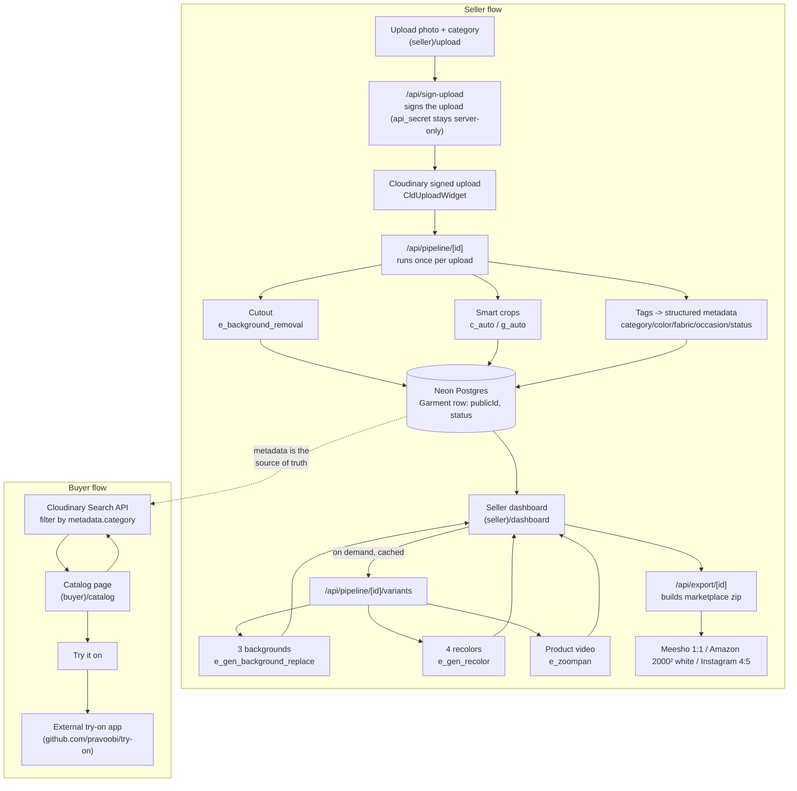

# Ethnic Studio

Hackathon entry for *Pixels to Products — Cloudinary AI Hackathon 2026* (HackIndia, Track 2 —
Generative Content Workflows).

**Problem:** small Indian ethnic-wear sellers (saree/kurta/lehenga) can't afford photoshoots, but
every marketplace listing (Meesho, Amazon, Instagram) needs multiple sizes, backgrounds, and
color variants of the same garment.

**What it does:** a seller uploads one flat photo and gets a complete listing back — a clean
cutout, auto-populated tags, three generative lifestyle backgrounds, four color variants, a short
product video, and marketplace-ready crops — all real Cloudinary API work, nothing hand-made.
Buyers get a catalog filtered by that same structured metadata via the Cloudinary Search API,
with a link out to a companion virtual try-on app.

See `CLAUDE.md` for full project context and the day-by-day timeline. See `docs/progress.md` and
`docs/decisions.md` for current status and the reasoning behind every deviation from the plan
(including two real Cloudinary bugs found and fixed by testing against a live account, not
assumed from docs).

## Architecture

Every URL delivered anywhere in the app uses `f_auto,q_auto`. Transformation strings are built
only as pure functions in `lib/cloudinary/transforms.ts` (unit tested, no live calls) — nothing
inline in a component. Generative transforms only ever run from the pipeline or the on-demand
variants route, never on page render; results are persisted (`variantsGeneratedAt` on the
`Garment` row) and served from the cache on every later view.

## Cloudinary feature map

| Pipeline step | Cloudinary capability | Where | Notes |
|---|---|---|---|
| Signed upload | Upload API, server-signed | `app/api/sign-upload/route.ts`, `(seller)/upload/UploadForm.tsx` | `api_secret` never reaches the client; rate-limited per IP (`lib/rateLimit.ts`) to protect Cloudinary credits on the public demo |
| Cutout | `e_background_removal` | `buildCutoutTransformation` in `lib/cloudinary/transforms.ts` | Also the input asset for dominant-color detection |
| Tags → metadata | Structured metadata fields | `lib/cloudinary/metadata.ts` | `category`/`fabric`/`occasion`/`status` from seller input + presets; `color` is a custom HSL hue-family classifier (`lib/colorNaming.ts`) layered on Cloudinary's own top color, because Cloudinary's `predominant` bucketing proved too coarse on real photos — see `docs/decisions.md` |
| Smart crops | `c_auto,g_auto` + fixed export sizes | `buildExportTransformation`, `lib/presets.ts` `EXPORT_PRESETS` | Meesho 1:1, Amazon 2000×2000 (white bg via cutout+pad, not `b_white` alone — that's a no-op with `c_fill`), Instagram 4:5 |
| Generative backgrounds | `e_gen_background_replace` | `buildGenBackgroundReplaceTransformation`, `lib/presets.ts` `BACKGROUND_PRESETS` | 3 preset prompts: studio-white, festive-mandap, lifestyle-instagram |
| Color variants | `e_gen_recolor` | `buildGenRecolorTransformation`, `lib/presets.ts` `RECOLOR_PALETTE` | 4-color palette: maroon, royal blue, emerald, mustard |
| Product video | `e_zoompan` (+ `b_gen_fill` extend for stills) | `buildVideoTransformation`, `lib/presets.ts` `VIDEO_PRESET` | Still photo → 4s looping 4:5 video for Instagram |
| Delivery | `f_auto,q_auto` on every URL | `lib/cloudinary/transforms.ts`, `lib/cloudinary/clientUrl.ts` | Client components build the same delivery URLs as the server from the cloud name (public) + pure transform strings — no secret needed, no extra round-trip |
| Buyer search | Search API, `metadata.*` expressions | `lib/cloudinary/search.ts`, `(buyer)/catalog` | Only ever returns `metadata.status="ready"` assets |

## Test walkthrough

1. **Upload:** go to `/upload`, pick a category, upload one garment photo. Watch the pipeline run
   (cutout → crop → tag → metadata) and land on `/dashboard`.
2. **Dashboard:** the new garment card shows the original, the cutout, its detected
   category/color, and export links. Click **"Generate backgrounds, colors & video"** — a
   full-screen lightbox opens immediately (loading state, then the video first, followed by 3
   backgrounds and 4 recolors as a thumbnail strip you can click through or navigate with the
   ‹ › arrows / arrow keys). Reopening later via the (now indigo) **"View..."** button is instant
   — nothing regenerates.
3. **Export:** download the marketplace zip (Meesho/Amazon/Instagram crops, no cropping of the
   garment itself).
4. **Catalog:** go to `/catalog`, filter by category, confirm results match what's on the
   dashboard, and follow **"Try it on"** out to the companion try-on app.
5. **Cloudinary console:** open the account's Media Library / Search to see the same assets,
   derived transforms, and structured metadata fields the app just used — nothing here is faked
   or pre-baked outside the seed script.

## Setup

1. `pnpm install`
2. Create a free Postgres database at [neon.tech](https://neon.tech) — used for both local dev
   and prod (see `docs/decisions.md` for why).
3. Copy `.env.example` to `.env.local` and fill in your Cloudinary credentials and the Neon
   connection string.
4. `pnpm prisma migrate dev` (creates the schema on your Neon database)
5. `pnpm dev`

## Commands

- `pnpm dev` — local dev server
- `pnpm build` — production build (must pass before every commit to `main`)
- `pnpm lint` / `pnpm typecheck`
- `pnpm test` — vitest unit tests for `lib/cloudinary/transforms.ts`
- `pnpm spike` — hand-tests every Cloudinary AI feature against photos in `fixtures/spike-photos/`
- `pnpm setup:metadata` — one-time, idempotent: creates the Cloudinary structured metadata fields
- `pnpm seed` — seeds demo garments from `fixtures/seed-photos/` (app must be running)
- `pnpm db:migrate:deploy` — applies pending migrations to prod (run once against Neon after
  first creating the database, and again after any future schema change)

## Deploying (Vercel)

1. Connect this repo in the Vercel dashboard.
2. Set every variable from `.env.example` in the Vercel project's Environment Variables —
   including `DATABASE_URL` (the same Neon connection string used locally is fine, or a separate
   prod database if you'd rather keep them apart).
3. Before or right after the first deploy, run `pnpm db:migrate:deploy` from your machine
   (pointed at whichever `DATABASE_URL` the deployment uses) — Vercel's build does not run
   migrations automatically, only `prisma generate` (via the `postinstall` script).
4. Once live, run `pnpm seed` with `SEED_BASE_URL` set to the deployed URL to populate demo
   garments, or seed against a local dev server first and reuse the same database.

## Hackathon toolkit

Per the [Cloudinary hackathon page](https://cloudinary.com/pages/hackathons/)'s requirement to
"use the React or Next.js AI Starter Kit and/or our AI Skills Pack" — this project uses the
**AI Skills Pack** (`.claude/skills/`, installed via `npx skills add cloudinary-devs/skills`),
the option Cloudinary's own docs recommend for an existing app rather than the starter-kit
scaffold. See `docs/decisions.md` for why.

## Status

Core pipeline, generative layer, and buyer catalog are built and verified live against a real
Cloudinary account and a real Neon Postgres database (17 seeded garments). Harden-phase work on
our side is done: Postgres unified for dev/prod, rate-limited upload route, full-history
credential audit clean. Still open: deploying to Vercel and linking the hackathon GitHub repo
(both deliberately deferred — currently developed and tested locally only), and the remaining
Sep 30 docs / Oct 1 video / Oct 2 submission steps. See `docs/progress.md` for the full history
and `docs/decisions.md` for every deviation from the original plan and why.
